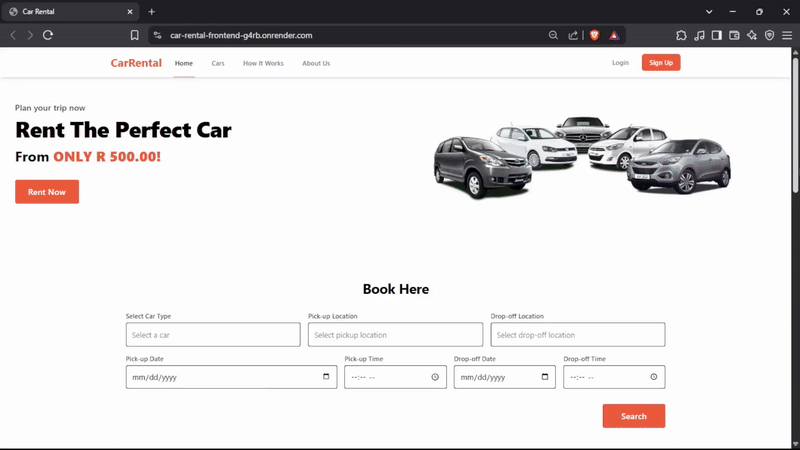

# Car Rental App

## Description

The Car Rental App is a web-based platform designed to simplify the process of renting cars online. Users can browse available cars, book rentals, and manage their reservations. This project aims to streamline car rental operations and provide a seamless user experience for customers.

## Key Features

*   **Browse Cars:** View available rental cars with detailed information such as model, make, year, price, and availability.
*   **Booking System:** Users can book cars for specific dates and times.
*   **User Management:** Users can register and log in to manage their personal bookings.
*   **Responsive Design:** The application is designed to work seamlessly on various devices (desktops, tablets, and mobile phones).
* **User Authentication:** Secure user registration and login.
* **Booking Management:** Users can view and manage their bookings.

## Technologies Used

**Frontend:**

*   React
*   Vite (for development and build)
*   React Query (for data fetching and caching)
*   React Router (for navigation)
*   Tailwind CSS (for styling)

**Backend:**

*   Node.js
*   Express.js
*   MongoDB (with Mongoose)
*   JWT Authentication (for secure user authentication)
*   cors (for Cross-Origin Resource Sharing)
*   cookie-parser (for handling cookies)
*   dotenv (for environment variables)

## Screenshots/GIFs

Check out a quick walkthrough of the application below:



## Setup and Installation

### Prerequisites

*   **Node.js:** Ensure you have the latest stable version installed. You can download it from [https://nodejs.org/](https://nodejs.org/).
*   **MongoDB:** You can use a local installation or a cloud database like MongoDB Atlas ([https://www.mongodb.com/atlas/database](https://www.mongodb.com/atlas/database)).

### Installation Steps

1.  **Clone the repository:**

    ```bash
    git clone https://github.com/banelemjaji/car-rental-app.git
    cd car-rental-app
    ```

2.  **Backend Setup:**

    ```bash
    cd backend
    npm install
    ```

3.  **Frontend Setup:**

    ```bash
    cd ../frontend
    npm install
    ```


## Running the Application

1.  **Start Backend Server:**

    ```bash
    cd backend
    npm start
    ```

2.  **Start Frontend Server:**

    ```bash
    cd frontend
    npm run dev
    ```

3. **Set Up Environment Variables:**

    *Create a .env file in the backend directory and add the following variables:*

    ```bash
    PORT=5001
    MongoDB_URI=your-mongodb-connection-string
    JWT_SECRET=your-secret-key
    ```

## API Endpoints

**Cars (`/api/cars`):**

| Method | Endpoint        | Description                               |
| :----- | :-------------- | :---------------------------------------- |
| GET    | `/api/cars`     | Fetch all available cars                  |
| POST   | `/api/cars`     | Add a new car (Admin)                     |
| PUT    | `/api/cars/:id` | Update a car (Admin)                      |
| DELETE | `/api/cars/:id` | Remove a car (Admin)                      |
| GET    | `/api/cars/:id` | Get details of a specific car             |

**Bookings (`/api/bookings`):**

| Method | Endpoint           | Description                 |
| :----- | :----------------- | :-------------------------- |
| GET    | `/api/bookings`    | Fetch all bookings          |
| POST   | `/api/bookings`    | Create a booking            |
| DELETE | `/api/bookings/:id` | Cancel a booking            |
| GET    | `/api/bookings/:id` | Get details of a booking    |

**Authentication (`/api/auth`):**

| Method | Endpoint              | Description                 |
| :----- | :-------------------- | :-------------------------- |
| POST   | `/api/auth/register`  | Register a new user         |
| POST   | `/api/auth/login`     | Log in an existing user     |
